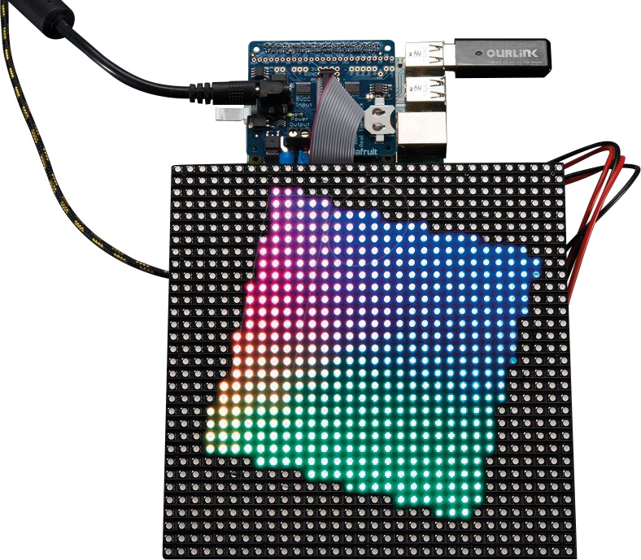

# Blinken K8s

## Demo for Rancher Elemental on Raspberry Pi 4

This repository contains the application and custom resources to setup a demo of [Elemental](https://elemental.docs.rancher.com/) on a Raspberry Pi 4 with a RGB LED Matrix connected to the GPIOs.

It covers:

- Creating an Elemental registration endpoint
- Configuring a cluster
- Assigning a device to the cluster
- Deploying an application to the device that interacts with the matrix display attached to the GPIO.

## Hardware

- Raspberry Pi 4
- [Waveshare RGB Matrix 64x64](https://www.waveshare.com/wiki/RGB-Matrix-P3-64x64) - Similar hardware from other vendors should work fine

## Notes

TODO